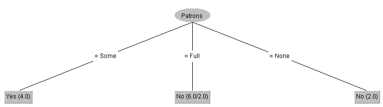
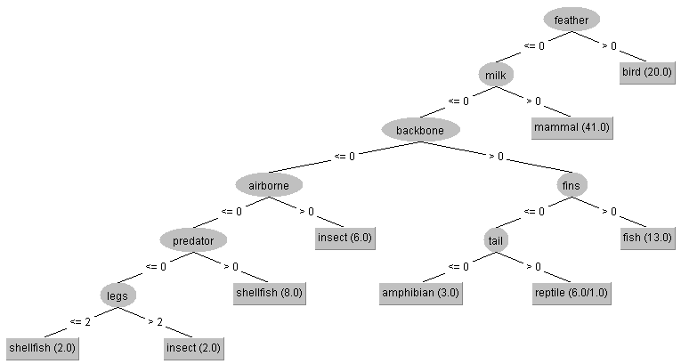
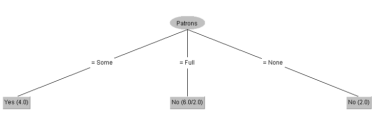

# Aufgabe 1

| Nr. | Alter      | Einkommen | Bildung  | Kandidat |
|:----|:-----------|:----------|:---------|:---------|
| 1   | $`\ge 35`$ | hoch      | Abitur   | O        |
| 2   | $`< 35`$   | niedrig   | Master   | O        |
| 3   | $`\ge 35`$ | hoch      | Bachelor | M        |
| 4   | $`\ge 35`$ | niedrig   | Abitur   | M        |
| 5   | $`\ge 35`$ | hoch      | Master   | O        |
| 6   | $`< 35`$   | hoch      | Bachelor | O        |
| 7   | $`< 35`$   | niedrig   | Abitur   | M        |

## Cal3

$S_1 = 4$
$S_2 = 0.7$
| NR. | Liniar Baum |
| --- | --- |
| 0  | * |
| 1  | /O1/ |
| 2  | /O2/ |
| 3  | /O2M1/ |
| 4  | /O2M2/ |
| _  | $X_1$(*,/M1/) |
| 5  | $X_1$(*,/O1M1/) |
| 6  | $X_1$(/O1/,/O1M1/) |
| 7  | $X_1$(/O1M1/,/O1M1/) |
| 1  | $X_1$(/O1M1/,/O2M1/) |
| 2  | $X_1$(/O2M1/,/O2M1/) |
| 3  | $X_1$(/O2M1/,/O2M2/) |
| _  | $X_1$(/O2M1/,$X_2$(*,/M1/)) |
| 4  | $X_1$(/O2M1/,$X_2$(/M1/,/M1/)) |
| 5  | $X_1$(/O2M1/,$X_2$(/M1/,/M1O1/)) |
| 6  | $X_1$(/O3M1/,$X_2$(/M1/,/M1O1/)) |
| _  | $X_1$(O,$X_2$(/M1/,/M1O1/)) |
| 7  | - |
| 1  | $X_1$(O,$X_2$(/M1/,/M1O2/)) |
| 2  | - |
| 3  | $X_1$(O,$X_2$(/M1/,/M2O2/)) |
| _  | $X_1$(O,$X_2$(/M1/,$X_3$(*,/M1/,*))) |
| 4  | $X_1$(O,$X_2$(/M2/,$X_3$(*,/M1/,*))) |
| 5  | $X_1$(O,$X_2$(/M2/,$X_3$(*,/M1/,/O1/))) |
| 6  | - |
| 7  | - |
| 1  | $X_1$(O,$X_2$(/M2/,$X_3$(/O1/,/M1/,/O1/))) |
| 2  | - |
| 3  | $X_1$(O,$X_2$(/M2/,$X_3$(/O1/,/M2/,/O1/))) |
| 4  | $X_1$(O,$X_2$(/M3/,$X_3$(/O1/,/M2/,/O1/))) |
| 5  | $X_1$(O,$X_2$(/M3/,$X_3$(/O1/,/M2/,/O2/))) |
| 6  | - |
| 7  | - |
| 1  | $X_1$(O,$X_2$(/M3/,$X_3$(/O2/,/M2/,/O2/))) |
| 2  | - |
| 3  | $X_1$(O,$X_2$(/M3/,$X_3$(/O2/,/M3/,/O2/))) |
| 4  | $X_1$(O,$X_2$(/M4/,$X_3$(/O2/,/M3/,/O2/))) |
| _  | $X_1$(O,$X_2$(M,$X_3$(/O2/,/M3/,/O2/))) |
| 5  | $X_1$(O,$X_2$(M,$X_3$(/O2/,/M3/,/O3/))) |
| 6  | - |
| 7  | - |
| 1  | $X_1$(O,$X_2$(M,$X_3$(/O3/,/M3/,/O3/))) |
| 2  | - |
| 3  | $X_1$(O,$X_2$(M,$X_3$(/O3/,/M4/,/O3/))) |
| _  | $X_1$(O,$X_2$(M,$X_3$(/O3/,M,/O3/))) |
| 4  | - |
| 5  | $X_1$(O,$X_2$(M,$X_3$(/O3/,M,/O4/))) |
| _  | $X_1$(O,$X_2$(M,$X_3$(/O3/,M,O))) |
| 6  | - |
| 7  | - |
| 1  | $X_1$(O,$X_2$(M,$X_3$(/O4/,M,O))) |
| _  | $X_1$(O,$X_2$(M,$X_3$(O,M,O))) |
| 2  | - |
| 3  | - |
| 4  | - |
| 5  | - |
| 6  | - |
| 7  | - |

## ID3

Es gibt 7 Datensätze:

- O: 4  
- M: 3 

$Entropy(S) = -\frac{4}{7}\log_2\frac{4}{7} - \frac{3}{7}\log_2\frac{3}{7} = 0.985$

### Alter:

<35: O2, M1  
≥35: O2, M2  

$H(<35) = -\frac{2}{3}\log_2\frac{2}{3} - \frac{1}{3}\log_2\frac{1}{3} = 0.918$  
$H(≥35) = -\frac{1}{2}\log_2\frac{1}{2} - \frac{1}{2}\log_2\frac{1}{2} = 1.000$  

$H_{gewichtet} = \frac{3}{7} \cdot 0.918 + \frac{4}{7} \cdot 1.000 = 0.964$  

$Gain(S, Alter) = 0.985 - 0.964 = 0.021$

### Einkommen:

hoch: O3, M1  
niedrig: O1, M2  

$H(hoch) = -\frac{3}{4}\log_2\frac{3}{4} - \frac{1}{4}\log_2\frac{1}{4} = 0.811$  
$H(niedrig) = -\frac{1}{3}\log_2\frac{1}{3} - \frac{2}{3}\log_2\frac{2}{3} = 0.918$  

$H_{gewichtet} = \frac{4}{7} \cdot 0.811 + \frac{3}{7} \cdot 0.918 = 0.857$  

$Gain(S, Einkommen) = 0.985 - 0.857 = 0.128$

---

### Bildung:

Abitur: O1, M2  
Bachelor: O1, M1  
Master: O2, M0  

$H(Abitur) = -\frac{1}{3}\log_2\frac{1}{3} - \frac{2}{3}\log_2\frac{2}{3} = 0.918$  
$H(Bachelor) = -\frac{1}{2}\log_2\frac{1}{2} - \frac{1}{2}\log_2\frac{1}{2} = 1.000$  
$H(Master) = -\frac{2}{2}\log_2\frac{2}{2} - \frac{0}{2}\log_2\frac{0}{2} = 0.000$  

$H_{gewichtet} = \frac{3}{7} \cdot 0.918 + \frac{2}{7} \cdot 1.000 + \frac{2}{7} \cdot 0.000 = 0.679$  

$Gain(S, Bildung) = 0.985 - 0.679 = 0.306$

### Vergleich
Alter = 0.021  
Einkommen = 0.128  
Bildung = 0.306  <-- Best  

### Aufteilung nach Bildung

#### Bildung = Master

Fälle: O2, M0 → alle O  
Blatt: O

#### Bildung = Bachelor

Fälle: O1, M1  
Einkommen = hoch für beide → kein Informationsgewinn  
Alter trennt die Klassen perfekt → nächstes Attribut: **Alter**  

Split nach Alter:
-  <35 → O  
-  ≥35 → M

#### Bildung = Abitur

Fälle: O1, M2  
Berechnung der Gains für die Teilmenge:

  Entropie der Teilmenge:

  $H(S_{\text{Abitur}}) = -\frac{1}{3}\log_2\frac{1}{3} - \frac{2}{3}\log_2\frac{2}{3} = 0.918$

  Gain für Alter:  

  <35: O0, M1 → $H(<35) = -\frac{0}{1}\log_2\frac{0}{1} - \frac{1}{1}\log_2\frac{1}{1} = 0$  
  ≥35: O1, M1 → $H(≥35) = -\frac{1}{2}\log_2\frac{1}{2} - \frac{1}{2}\log_2\frac{1}{2} = 1.000$  

  Gewichtete Entropie:

  $H_{gewichtet}(Alter) = \frac{1}{3} \cdot 0 + \frac{2}{3} \cdot 1.000 = 0.667$

  $Gain(Alter) = H(S_{\text{Abitur}}) - H_{gewichtet}(Alter) = 0.918 - 0.667 = 0.251$

  Gain für Einkommen:  

  $H(hoch) = -\frac{1}{1}\log_2\frac{1}{1} - \frac{0}{1}\log_2\frac{0}{1} = 0$  
  $H(niedrig) = -\frac{0}{2}\log_2\frac{0}{2} - \frac{2}{2}\log_2\frac{2}{2} = 0$  

  Gewichtete Entropie:

  $H_{gewichtet}(Einkommen) = \frac{1}{3} \cdot 0 + \frac{2}{3} \cdot 0 = 0$

  $Gain(Einkommen) = H(S_{\text{Abitur}}) - H_{gewichtet}(Einkommen) = 0.918 - 0 = 0.918$

Ergebnis: Einkommen → besserer Split  

Split nach Einkommen:
- hoch → O  
- niedrig → M

Baum = $X_3$​(O,$X_1$(O,M),$X_2$(M,O)

# Aufgabe 2

|Nr.| Baum    | Regel |
|---| ---     | ---   |
|0| $x_3 ( x_2 ( x_1 ( C , A ) , x_1 ( B , A ) ) , x_1 ( x_2 ( C , B ) , A ) )$ |-|
|1|$x_3 ( x_1 ( x_2 ( C , B ) , x_2 ( A , A ) ) , x_1 ( x_2 ( C , B ) , A ) )$|Transformationsregel auf linken Teilbaum|
|2|$x_3 ( x_1 ( x_2 ( C , B ) , A ) , x_1 ( x_2 ( C , B ) , A ) )$|x_2 ( A , A ) => A
|3|$x_1 ( x_2 ( C , B ) , A ))$|Bedingt irrelevantes Attribut

# Aufgabe 3
## 1
In der Confusion Matrix kann man ablesen wie oft etwas eine Klasse falsch katigoigiert wurde und mit was sie vertaust wurde.
### Zoo

### Restaurant

## 2
 - ordinal/numeric: für Zahlen
 - string: Text werte
 - nominal: vordefinierte Menge von Strings
 
## 3
### Zoo J48

### Zoo ID3
---  
### Restaurant J48

### Restaurant ID3

Patrons = Some: Yes  
Patrons = Full  
|  Type = French: No  
|  Type = Thai  
|  |  Fri/Sat = No: No  
|  |  Fri/Sat = Yes: Yes  
|  Type = Burger  
|  |  YesAlternate = Yes: Yes  
|  |  YesAlternate = No: No  
|  Type = Italian: No  
Patrons = None: No  

### Fazit
Für den Restaurant Datensatz sieht der Baum  bei J48 Sehr klein aus, da der Datensatz auch sehr klein ist. ID3 Konnte einen baum aufstellen, der Fehler Frei das Ergebniss bestimmen kann.