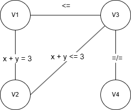

# Praktikum 5

## 1

$V =$ \{$Haus * x$\}$  

$Haus =$ \{$Nummer, Farbe, Nationalität, Haustier, Getränk, Zigaretten$\}

$D =$ \{  
    $D_{Nummer} = \{1,2,3,4,5\}$  
    $D_{Farbe} = \{gelb, blau, rot, weiß, grün\}$  
    $D_{Nationalität} = \{Norweger, Ukrainer, Engländer, Spanier, Japaner\}$  
    $D_{Haustier} = \{Fuchs, Pferd, Schnecken, Hund, Zebra\}$  
    $D_{Getränk} = \{Wasser, Tee, Milch, O-Saft, Kaffee\}$  
    $D_{Zigaretten} = \{Kools, Chesterfield, Old$ $Gold, Lucky$ $Strike, Parliament\}$  
\}  

Für jeden folgenden Constraint wird bedingt, das die beiden angegeben Variablen, wenn nicht anders angegeben, zum selben Haus gehören.

$C = \{$  
    $c_1 = \{x = 5\}$  
    $c_2 = \{(Nationalität, Farbe), Engländer = rot\}$  
    $c_3 = \{(Nationalität, Haustier), Spanier = Hund\}$  
    $c_4 = \{(Farbe, Getränk), grün = Kaffee\}$  
    $c_5 = \{(Nationalität, Getränk), Ukrainer = Tee\}$  
    $c_6 = \{(v_1: Haus(Farbe = grün), v_2: Haus(Farbe = weiß)), v_1.Nummer = v_2.Nummer +1\}$  
    $c_7 = \{(Zigaretten, Haustier), Old$ $Gold = Schnecken\}$  
    $c_8 = \{(Zigaretten, Farbe), Kools = gelb\}$  
    $c_9 = \{(Getränk, Nummer), Milch = 3\}$  
    $c_{10} = \{(Nationalität, Nummer), Norweger = 1\}$  
    $c_{11} = \{(v_1: Haus(Zigaretten = Chesterfield), v_2: Haus(Haustier = Fuchs)), v_1.Nummer = v_2.Nummer \plusmn 1\}$  
    $c_{12} = \{(v_1: Haus(Zigaretten = Kools), v_2: Haus(Haustier = Pferd)), v_1.Nummer = v_2.Nummer \plusmn 1\}$  
    $c_{13} = \{(Zigaretten, Getränk), Lucky$ $Strike = O-Saft\}$  
    $c_{14} = \{(Nationalität, Zigaretten), Japaner = Parliaments\}$  
    $c_{15} = \{(v_1: Haus(Nationalität = Norweger), v_2: Haus(Farbe = blau)), v_1.Nummer = v_2.Nummer \plusmn 1\}$  
$\}$

## 2
Siehe BTSearch.py
## 3

### 3.1

### 3.2

Queue | ARC_Reduce | $D_1$ | $D_2$ | $D_3$ | $D_4$
--- | --- | --- | --- | --- | ---
$(v_1, v_2)$, $(v_2, v_1)$, $(v_2, v_3)$, $(v_3, v_2)$, $(v_1, v_3)$, $(v_3, v_1)$, $(v_3, v_4)$, $(v_4, v_3)$ | $-$ | 0-5 | 0-5 | 0-5 | 0-5
$(v_2, v_1)$, $(v_2, v_3)$, $(v_3, v_2)$, $(v_1, v_3)$, $(v_3, v_1)$, $(v_3, v_4)$, $(v_4, v_3)$ | true | 0-3 | 0-5 | 0-5 | 0-5
$(v_2, v_3)$, $(v_3, v_2)$, $(v_1, v_3)$, $(v_3, v_1)$, $(v_3, v_4)$, $(v_4, v_3)$, $(v_1, v_2)$ | true | 0-3 | 0-3 | 0-5 | 0-5
$(v_3, v_2)$, $(v_1, v_3)$, $(v_3, v_1)$, $(v_3, v_4)$, $(v_4, v_3)$, $(v_1, v_2)$ | false | 0-3 | 0-3 | 0-5 | 0-5
$(v_1, v_3)$, $(v_3, v_1)$, $(v_3, v_4)$, $(v_4, v_3)$, $(v_1, v_2)$, $(v_2, v_3)$ | true | 0-3 | 0-3 | 0-3 | 0-5
$(v_3, v_1)$, $(v_3, v_4)$, $(v_4, v_3)$, $(v_1, v_2)$, $(v_2, v_3)$ | false | 0-3 | 0-3 | 0-3 | 0-5
$(v_3, v_4)$, $(v_4, v_3)$, $(v_1, v_2)$, $(v_2, v_3)$ | false | 0-3 | 0-3 | 0-3 | 0-5
$(v_4, v_3)$, $(v_1, v_2)$, $(v_2, v_3)$ | false | 0-3 | 0-3 | 0-3 | 0-5
$(v_1, v_2)$, $(v_2, v_3)$ | false | 0-3 | 0-3 | 0-3 | 0-5
$(v_2, v_3)$ | false | 0-3 | 0-3 | 0-3 | 0-5
$-$ | false | 0-3 | 0-3 | 0-3 | 0-5

## 4

### 4.1

Variable | Start | End
--- | --- | ---
$v_1$ | \{2\} | \{2\}
$v_2$ | \{0,1,2,3,4,5\} | \{1\}
$v_3$ | \{0,1,2,3,4,5\} | \{2\}
$v_4$ | \{0,1,2,3,4,5\} | \{0,1,3,4,5\}

### 4.2

Variable | Start | End
--- | --- | ---
$v_1$ | \{2\} | \{2\}
$v_2$ | \{0,1,2,3,4,5\} | \{1\}
$v_3$ | \{0,1,2,3,4,5\} | \{0,1,2\}
$v_4$ | \{0,1,2,3,4,5\} | \{0,1,2,3,4,5\}

Die gesamte Kantenkonsistenz hat im Kontrast zum Forward Checking 3 zusätzliche Werte aus den Wertebereichen entfernt.

## 5

$V = \{Obj\}$

$Obj = \{Name, PosX, PosY, Hoehe, Breite\}$

$D = \{$  
$D_{Obj.PosX} = \{0 - 1000\}$  
$D_{Obj.PosY} = \{0 - 400\}$  
$D_{Obj.Hoehe} = \{0 - 1000\}$  
$D_{Obj.Breite} = \{0 - 400\}$  
$D_{Obj.Name} = \{Bar, Kletterberg, Hüpfburg, Notausgang, Eingang\}$  
$\}$  

$C = \{$  
$c_1 = \{(Obj, x \epsilon Platzierte Obj), NOT($  
$((Obj.PosX - 10) < x.PosX < (Obj.PosX + Obj.Breite + 10)\ OR$  
$(Obj.PosX - 10) < (x.PosX + x.Breite) < (Obj.PosX + Obj.Breite + 10))\ AND$  
$((Obj.PosY - 10) < x.PosY < (Obj.PosY + Obj.Hoehe + 10)\ OR$  
$(Obj.PosY - 10) < (x.PosY + x.Hoehe) < (Obj.PosY + Obj.Hoehe + 10))$  
$)\}$  
$c_2 = \{Obj.Name = Notausgang\ OR\ Obj.Name = Eingang \rArr (Obj.PosX \epsilon \{0, 1000\}\ AND\ Obj.Breite = 0)\ OR\  (Obj.PosY \epsilon \{0, 400\}\ AND\ Obj.Hoehe = 0)\}$  
$c_3 = \{$Der kürzeste Vektor zwischen der Bar und jedem Objekt, dass kein Notausgang oder Eingang ist darf nicht durch den Bereich eines anderen Objektes verlaufen.$\}$  
$\}$
